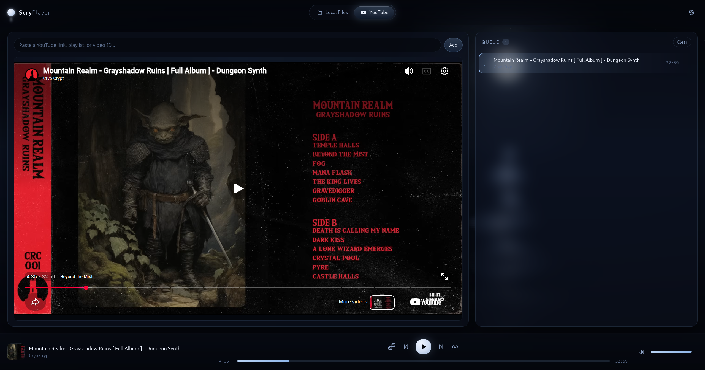
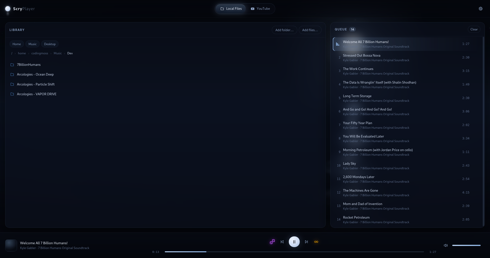

# Scry Player

A media player meant as a local web app

This was initially Generated via [Claude Code](https://claude.com/product/claude-code) just to see how well it can do from scratch for this particular set of requirements

This player supports two sources: 
1. Local files / folders
2. YouTube

Switch between them with the picker at the top.

### Stack

- **Frontend** — modern JS, no framework and **no bundler**. Plain ES modules
  loaded natively by the WebView, plain CSS. npm is only there to install the
  Tauri CLI.
- **Backend** — Tauri 2 (Rust). Directory walking and audio tag reading
  ([lofty](https://crates.io/crates/lofty)), plus native file dialogs.

## Keyboard

| Key | |
|---|---|
| `Space` | play / pause |
| `←` `→` | seek ∓5s |
| `Shift` `←` `→` | previous / next |
| `↑` `↓` | volume |
| `M` | mute |


## Example Screenshots





## Known limits

- YouTube **playlist** URLs add only the linked video; whole-playlist expansion
  is not implemented.
- Videos whose owners disabled embedding cannot play — YouTube's rule, not ours.
- Age-restricted videos cannot play in an embed at all; YouTube sends the viewer
  back to youtube.com instead.
- The window will not shrink below 1000px wide. Narrower, the panes stack and the
  16:9 player drops under the 200x200 an embedded player is required to keep.
- Formats the WebView cannot decode (`.wma`, `.aiff`, …) are listed but marked
  unplayable rather than hidden.
- Restored sessions cap at 500 tracks per queue, the practical `localStorage`
  limit.

## Dev Notes

### Requirements

- Rust (stable, ≥ 1.77.2)
- Node ≥ 18 — only to run the Tauri CLI
- On Debian/Ubuntu, the Tauri system libraries:

```bash
sudo apt install libwebkit2gtk-4.1-dev libgtk-3-dev libsoup-3.0-dev librsvg2-dev build-essential curl wget file libssl-dev libayatana-appindicator3-dev
```

### Running

Then you can run the app via:
```bash
npm install
npm run dev
```

`npm run build` produces a bundled desktop binary in `src-tauri/target/release`.

### Tests

```bash
npm run test:all
```

Both halves, no test framework on either side. The frontend runs on Node's own
runner (`npm test`, or `npm run test:watch`); Rust runs under `cargo test`.
`npm run test:coverage` adds a coverage table.

Frontend tests live in `tests/`, out of `src/` because Tauri bundles that whole
directory into the app. `jsdom` is the one dependency they add, and it covers
`ui/` — element construction and event wiring. It does not stretch to the
adapters: jsdom builds an `<audio>` element but `play()` throws and it never
fires `timeupdate` or `ended`, so `localAdapter` and `youtubeBridgeAdapter`
(and the canvas in `water.js`) are left to a real engine rather than tested
against a fake that would only confirm itself.

Two things worth knowing:
- Tests that need more than a couple of elements build their DOM from the real
  `src/index.html` via `installAppDom()`, so a fixture cannot drift from the
  markup. Each call mints a fresh window, and so a fresh `localStorage` — which
  is what makes it a stand-in for restarting the app.
- jsdom does not implement `<dialog>`, so the helper shims `showModal`/`close`.
  The settings tests therefore prove *we* open and close at the right moments;
  modality, focus trapping and Escape are the browser's, and are the whole
  reason for using a native dialog. Those still want a click-through.

There is no frontend dev server of our own — Tauri serves `src/` directly and
reloads the window when those files change.

### How local audio reaches the player

Over a loopback HTTP server (`src-tauri/src/server.rs`), which is not the
obvious choice — it is the only one that works. Both alternatives were tried
and measured on WebKitGTK:

| route | result |
|---|---|
| `asset:` protocol | **will not load** — `MediaError` code 4 |
| `blob:` URL | plays, but **~18 dropouts per 20s** |
| loopback `http:` | **1 dropout per 20s** (a local player scored 2) |

Dropouts were counted by recording the sink monitor during playback and
running `silencedetect` over it. WebKitGTK's media pipeline refuses custom URI
schemes outright, and its blob source is too slow to feed the decoder.

### How YouTube gets a valid Referer

The main window loads from Tauri's own `tauri://` scheme, which has no real
network address, and YouTube now hard-rejects an embed request that arrives
with no `Referer` header at all.

`youtube-embed.html` + `youtube-embed.js` (compiled into the binary,
`src-tauri/src/server.rs`) are a second, tiny page served over the same
loopback HTTP server local audio already uses (see
["How local audio reaches the player"](#how-local-audio-reaches-the-player)).
The main window embeds *that* as an iframe instead of embedding YouTube
directly. Because the wrapper page has a genuine
`http://127.0.0.1` origin, its own embed of the real YouTube iframe carries a
normal Referer — solving the problem one level down, without the main
window's own origin ever changing. `youtubeBridgeAdapter.js` talks to it over
`postMessage` (play/pause/seek/volume out, state/time/meta back), presenting
the same adapter interface every other source does.

### Security notes

`MediaScope` (in `lib.rs`) starts **empty**. Paths enter only via a file dialog
or an explicit browse, and both the commands and the media server check against
it, so the page cannot reach arbitrary files. Both sides are canonicalised, so
symlinked libraries work.

The media server binds to `127.0.0.1` on an ephemeral port and additionally
requires a random per-session token, so another local process cannot read even
the allowed files without it.

File dialogs are opened from Rust rather than JS, so the frontend holds no
dialog permissions at all.

All user-supplied text (filenames, tags, YouTube titles) reaches the DOM via
`textContent`, never `innerHTML`.

### Updating local screenshots

Don't forget to install `x11-utils imagemagick` if needed

Get the running app into the state you want shown, then refresh one of the
above with:

```bash
GDK_BACKEND=x11 npm run dev
# in another terminal, once the app window is open and showing what you want:
npm run screenshot -- local
npm run screenshot -- youtube
```

### Cutting a release

Pushing a tag matching `v*` (e.g. `v0.2.0`) runs [`.github/workflows/release.yml`](.github/workflows/release.yml), which builds an AppImage and a `.deb` on Linux and an NSIS `.exe` installer on Windows, then attaches all three to a **draft** GitHub Release for that tag. Nothing goes live on its own — review the draft and publish it by hand once the builds look right.

A plain push to `main` builds nothing; only a tag does.

```bash
npm run release -- 0.2.0
```

Bumps the version in `package.json`, `src-tauri/tauri.conf.json` and `src-tauri/Cargo.toml`, commits that, tags it, and — after asking for confirmation — pushes both. Refuses to run from a dirty tree, a branch other than `main`, or a `main` that's behind `origin/main`.
